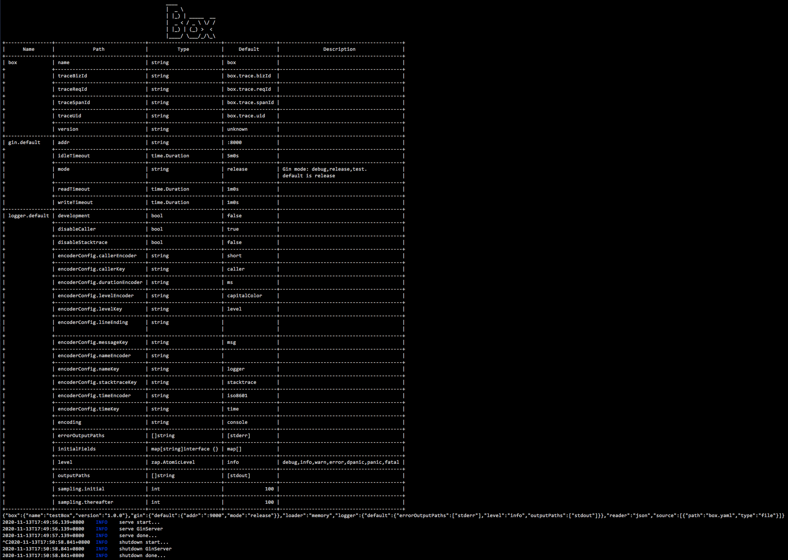

# Installation

```sh
go get -u github.com/boxgo/box
```

## Required

go version: **go1.12+**

grpc-go version: **1.26**

## Recommend

建议使用国内源：

1. [goproxy.cn](https://goproxy.cn/)
2. [goproxy.io](https://goproxy.io/)


# Qucik Start

1. 编写配置文件

```yaml
# box.yaml
box:
  name: testBox
  version: 1.0.0

gin:
  default:
    mode: release
    addr: ":9000"

logger:
  default:
    level: info
    outputPaths:
      - stdout
    errorOutputPaths:
      - stderr
```

2. 编写程序代码

```go
// main.go
package main

import (
	"github.com/boxgo/box"
	"github.com/boxgo/box/pkg/server/ginserver"
	"github.com/gin-gonic/gin"
)

func main() {
	app := box.New(
		box.WithBoxes(
			ginserver.Default,
		),
	)

	ginserver.GET("/ping", func(ctx *gin.Context) {
		ctx.Data(200, gin.MIMEPlain, []byte("pong"))
	})

	app.Run()
}
```

3. 启动程序

```sh
$ go run main.go # 启动程序
```



通过`go run main.go`命令启动我们的程序，可以看到如上所示界面，这个表格是我们程序所使用到的配置描述。紧跟其后的是程序启动时的配置信息。再往下，我们就看到了`box启动器`开始启动，`box启动器`启动GinServer服务，由于我们没有挂载其他组件，这时候启动器启动完成。

通过 `ctrl + c` 我们看到启动器开始停止工作，然后GinServer被关闭，整个进程退出。

1. 验证程序

```sh
$ curl http://127.0.0.1:9000/ping
$ pong
```

可以看到，请求ping接口已经返回"pong"了。
